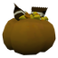
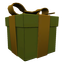

# Items

### Pumpkin

> Using for collector gamemode. Add pumpkin to player inventory after pickup. Player should drop this pumpkin to team bucket to increase team score.

### Spellbook

> Give random spell to player after pickup.

### Gift

> Give random cosmetic item to the player after pickup. Other players can't see and pickup your gift.
> Gift will be disappear after 120 seconds.