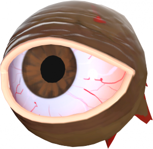

# Monoculus

> **Monoculus** is a boss NPC.
>
> Monoculus attack players using explosion eyeballs.
>
> Each 2000 damage to monoculus stun monoculus for 4.5 seconds.
> Any shot can make make monoculus angry with a 5% chance for 15 seconds, angry monoculus will be attack players by shots 3 rockets per 1 attack.
>
> Each 10-20 seconds monoculus teleports to random portal on the map.

### STATS

- **Health**: 10000
- **Speed** : 32 ups
- **Damage**: 80
- **Hit Range**: 3072 units
- **Hit Delay**: 1.0 sec
- **Size**: 96 x 96 x 96 units
