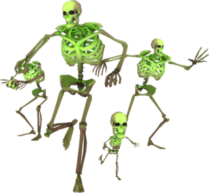

# Skeleton

> **Skeletons** are NPC, once they are close enough to a player, they will start to melee attack them.
>
> After death skeletons drop 3 invisible eggs which will be destroyed in 2 second and spawn small skeletons in their place.
>
> **Skeletons** are not solid for players.

### STATS

- **Health**: 100 (50 hp for small skeletons)
- **Speed** : 250 ups (300 ups for small skeletons)
- **Damage**: 16 (8 damage for small skeletons)
- **Hit Range**: 48 units (32 units for small skeletons)
- **Hit Delay**: 0.35 sec
- **Respawn Time**: 30 sec
- **Size**: 16 x 16 x 32 units