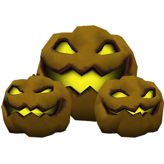

# Spooky Pumpkin

> **Spooky Pumpkin** is melee attack NPC, move with low jumps.

### STATS

- **Health**: 100 (200 hp for big pumpkin)
- **Speed** : 200 ups jump (jump velocity)
- **Damage**: 20 (40 for big pumpkin)
- **Hit Range**: 48 units
- **Hit Delay**: 0.5 sec
- **Respawn Time**: 30 sec
- **Size**: 12 x 12 x 24 units (16 x 16 x 32 units for big pumpkin)

### Credits
https://steamcommunity.com/sharedfiles/filedetails/?id=1167510708

- Benoist - NPC idea
- Chillax - Spooky Pumpkin Monster Animations
- Maxxy - Spooky Pumpkin Monster Models